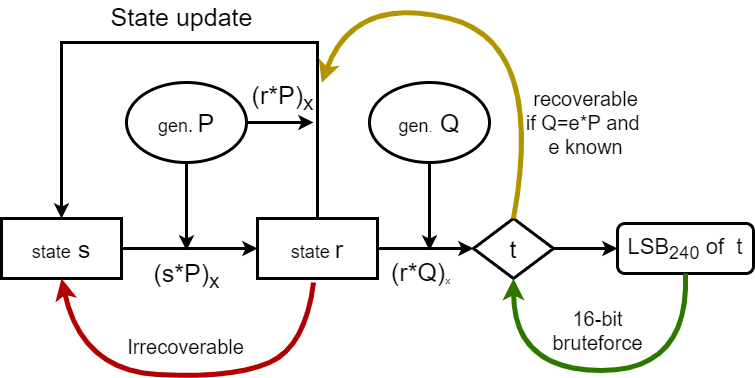
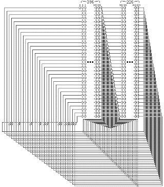

#  Project \- Analysis, State and Seed recovery of RNGs

|                  |             |               |            |
|       :--:       |      :--:   |       :--:    |   :--:     |
| Himanshu Sheoran | Yash Parmar | Lakshya Kumar | Sahil Jain |
|     170050105    |   170050004 |     170050033 | 180050089  |   

## Abstract
Study of novel methods for seed and state recovery with reduced number of outputs for general purpose random number generators like `MT19937`, `MT19937-64`, `LCGs & Truncated LCGs`, `LSFRs`, using **SMT/SAT solvers**. SMT/SAT solvers are used extensively in software-verification, in this paper we demonstrate how SMT solvers can be used as powerful oracles to analyse and break some cryptograpic primitives like random number generators.


## Introduction
<!-- ### Problem Statement -->
Given a PRNG algorithm $A$, which is initialised using an initial value aka `seed` and $x_1, x_2, ..., x_k$ be the generated outputs from the random number generator, we wish to determine the starting `seed` or the state $S$ required to predict the future outputs of the generator.  

Our work involves modelling the seed and state recovery problem of a PRNG by encoding it into a [Satisfiability Modulo Theories](https://en.wikipedia.org/wiki/Satisfiability_modulo_theories) (SMT) decision problem, which is an extension of SAT with theories in first order logic.   
We used the SMT solver [Z3Prover](https://github.com/Z3Prover/z3), as a sequential program written in theory of BitVectors for solving out SMT model of the PRNGs . After (painfully) modelling the program, we begin a SAT solver search (all-SAT to give all satisfying models for possible seed values) which leads us to a given sequence of outputs (the generated random numbers).  

The core idea behind using z3 is that it mixes the program data and the program quite well, eases the modelling a lot.  
Since theory of Bitvectors translates very well to algorithms designed and written in low level languages like C, and even assembly, most of them can be analysed very efficiently.  
All we need to care about *the correct SMTlib implementations* to use as the general notion of various operators like bitshifts, comparisons are translated differently based on different scenarios by a compiler.  

<!-- Our solution and what we did -->
With our method, we were able to recover the `seed` of standard mersenne twister (MT19937), which is the most used PRNG across all software systems, using only **3** outputs using SMT solvers in under 5 minutes, whereas all previous work is on state recovery using *624 consecutive outputs*.

Application of SMT encoding on truncated LCGs yielded comparable and in some cases way better results than the existing lattice based recovery techniques.  
SMT based attack on Geffe generator results was found to be significantly faster than the known correlation attacks.  

Extending the discussion, we further study the case of notorious DUAL EC DRBG CSPRNG for presence of kleptographic backdoor to gibe NSA the ability to predict all outputs given 32 bytes of keystream.

<!-- # Table of Contents
1. [Mersenne Twister](#mersenne-twister)
2. [LFSR](#lfsr)
3. [LCG](#linear-congruential-generator---lcg)
4. [Dual_EC_DRBG](#dual-ec-drbg---kleptographic-backdoor)
5. [References](#references)
6. [Appendix](#appendix)    -->


# Mersenne Twister
Mersenne Twister (MT) is by far the most widely used general-purpose PRNG, which derives its name from the fact that its period is the Mersenne prime $2^{19937} -1$

It is the default PRNG in Dyalog APL, Microsoft Excel, IDL, Julia, PHP, Pyhton, R, SageMath, standard C++, Mathematica and [many more!](#mersenne-twister-as-default-prng)

## Algorithmic Details
The Mersenne Twister algorithm is based on a matrix linear recurrence over a finite binary field $F_2$. The algorithm is a twisted generalised feedback shift register (twisted GFSR, or TGFSR) of rational normal form, with state bit reflection and tampering.  
The internal state is defined by a sequence of $n=624$, 32-bit registers ($w$)  
$$x_{k+n} \to x_{k+m} \oplus (( x_k^{u} \| x_{k+1}^{l})A)$$
To compensate for reduced dimensionality of equidistribution, the state is cascaded with tampering transform (to improve the equidistribution) to produce the outputm

$$y \to x \oplus(( x \gg u)\&d)$$
$$y \to y \oplus(( y \ll s)\&b)$$
$$y \to y \oplus(( y \ll t)\&c)$$
$$z \to y \oplus( y \gg l)$$

The computed $z$ is returned by the algorithm
where the choice of constants is as follows
```python
    w, n, m, r = 32, 624, 397, 31
    a = 0x9908B0DF
    u, d = 11, 0xFFFFFFFF
    s, b = 7, 0x9D2C5680
    t, c = 15, 0xEFC60000
    l = 18
    f = 1812433253 
```
## Initialization
The state needed for a Mersenne Twister implementation is an array of $n$ values of $w$ bits each. To initialize the array, a w-bit seed value is used to supply $x_0$ through $x_{n-1}$ by setting $x_0$ to the seed value and thereafter setting

$$x_i = f \times (x_{i-1} \oplus (x_{i-1} \gg (w-2))) + i$$

for $i$ from 1 to n-1. The first value the algorithm then generates is based on $x_n$. [See for details](#mersenne-gif)

\pagebreak

While implementing, we need to consider only three things   
1. State initialization i.e. seeding
```python
    def seed_mt(seed):
        MT[0] = seed
        index = n
        for i in range(1, n):
            temp = f * (MT[i - 1] ^ (MT[i - 1] >> (w - 2))) + i
            MT[i] = temp & ((1 << w) - 1)
```  
2. The `twist` operation to produce next 624 state registers by "twisting" the current state of 624 registers
```python
    def twist():
        for i in range(n):
            x = (MT[i] & upper_mask) + (MT[(i + 1) % n] & lower_mask)
            xA = x >> 1
            if (x % 2) != 0:
                xA = xA ^ a
            MT[i] = MT[(i + m) % n] ^ xA
        index = 0
```  
3. The `tamper` operation to tamper a state register to the produced 32-bit output
```python
    def extract_number():
        """aka tamper state at index"""
        y = MT[index]
        y = y ^ ((y >> u) & d)
        y = y ^ ((y << s) & b)
        y = y ^ ((y << t) & c)
        y = y ^ (y >> l)
        index += 1
        return y & ((1 << w) - 1)
```
## Background
The primary idea of cracking Mersenne twister comes as a part of [Matasano's Cryptopals challenges](https://cryptopals.com/sets/3/challenges/23), after which
there exist various conference talks for Mersenne twister seed and state recovery for the aid of pentesters at various security conferences e.g  
- [untwister](https://github.com/bishopfox/untwister) presented at B-Sides Las Vegas 2014, which recovers upto 32 bit seeds by a parallalized bruteforce using a pool of workers or state recovery using 624 consecutive outputs (will be discussed soon).  
- [PRNG Cracker](https://dspace.cvut.cz/bitstream/handle/10467/69409/F8-BP-2017-Molnar-Richard-thesis.pdf?sequence=-1&isAllowed=y) which in addition to parallalized seed bruteforcing, creates a rainbow table of outputs for lookup in seed database.  
- [PHP mt_rand predictor](https://www.ambionics.io/blog/php-mt-rand-prediction) achieves seed recover using two outputs which are 227 apart of each other exploiting the improper implementation of Mersenne twister in PHP in particular. This works only for PHP as it doesnt use the standard MT (Mersenne Twister) algorithm.

The most famous  way to recover the state of Mersenne Twister is using any 624 consecutive outputs. [We implemented the same](#state-recovery-from-624-consecutive-outputs) for comparison with our SAT-model.

## Our Work
We began with the implementation of standard MT19937 from algorithm described [on Wikipedia](https://en.wikipedia.org/wiki/Mersenne_Twister). This involved a lot of debugging and testing against various random number library implementations, *reading the source code* of the MT implementations in  
- [Python _randommodule.c](https://github.com/python/cpython/blob/master/Modules/_randommodule.c)  
- [ruby_2_7/random.c](https://github.com/ruby/ruby/blob/ruby_2_7/random.c)  
- [PHP random.c](https://github.com/php/php-src/blob/master/ext/standard/random.c)  
- [C++ libstdc++ gcc](https://code.woboq.org/gcc/libstdc++-v3/include/bits/random.tcc.html)

And figuring out how each of these vary from the standard implementation.
More or less, each one of these use the standard MT as an API to extract 32 bit uniformly random values from the underlying state of MT then constructing their own API out of this functionality.  
These include improved (and hence more non linear) initialization called `init_by_array` as proposed in [MT2002](http://www.math.sci.hiroshima-u.ac.jp/m-mat/MT/MT2002/emt19937ar.html), translation of equivalent functions from (usually) underlying c implementations to python and testing them rigorously to match the outputs and state. This is a bit challenging due to the fact python treats all integers without bounds and we need to ensure the general assertion of `int_32` everywhere is valid.  
This gave a very deep idea of how RNGs works in different systems/languages and how non-trivial it is going to be to model them as a SAT problem.

### Modelling
After getting all the underlying algorithms and functionalities right, we modelled the seed recovery algorithm as a z3 formula. The `tamper` state when written for a `BitVec(32) y` is almost exactly same as we would have written for a python-int
```python
def tamper_state(y):
    y = y ^ (LShR(y, u) & d)
    y = y ^ ((y << s) & b)
    y = y ^ ((y << t) & c)
    y = y ^ (LShR(y, l))
    return y
```
Note that `tamper_state(y)` actually returns the bitvector computation [LShR is Logical Shift Right]
```python
     y ^ LShR(y, 11) & 4294967295 ^ 
    (y ^ LShR(y, 11) & 4294967295) << 7 & 2636928640 ^
    (y ^ LShR(y, 11) & 4294967295 ^
    (y ^ LShR(y, 11) & 4294967295) << 7 & 2636928640) << 15 & 
    4022730752 ^ LShR(
     y ^ LShR(y, 11) & 4294967295 ^
    (y ^ LShR(y, 11) & 4294967295) << 7 & 2636928640 ^
    (y ^ LShR(y, 11) & 4294967295 ^
    (y ^ LShR(y, 11) & 4294967295) << 7 & 2636928640) << 15 &
    4022730752, 18)
```

And the general line of thinking while encoding a problem in SMT would be to find a `y` such that `tamper_state(y)==x` for a given value of interest `x`. Thus after solving for `y` we get the value which led the given value `x`.  
```python
def untamper_sat(num):
    S = Solver()
    y = BitVec('y', 32)
    y = tamper_state(y)
    S.add(num == y)
    if S.check() == sat:
        m = S.model()
        return m[m.decls()[0]].as_long()
```
This serves as an alternative to the `untamper` proposed earlier, although it is around ~100 times slower due to the overheads involving calling the z3 c++ API internally. But what advantages it provides with respect to the original untamper is that we can find **all possible candidates** `y` given say truncated output `untamper_state(y) >> truncation`.  
<!-- Although SAT/SMT solvers are designed to find a single satisfying assignment, they can be extended easily (with a bit of overhead) to find all possible satisfying assignments by blocking and fixing terms over the search space thus enabling the solver to use previously learned clauses effectively [Programming Z3](https://theory.stanford.edu/%7Enikolaj/programmingz3.html#sec-blocking-evaluations)  
```python
def all_smt(s, initial_terms):
    def block_term(s, m, t):
        s.add(t != m.eval(t))
    def fix_term(s, m, t):
        s.add(t == m.eval(t))
    def all_smt_rec(terms):
        if sat == s.check():
           m = s.model()
           yield m
           for i in range(len(terms)):
               s.push()
               block_term(s, m, terms[i])
               for j in range(i):
                   fix_term(s, m, terms[j])
               for m in all_smt_rec(terms[i:]):
                   yield m
               s.pop()   
    for m in all_smt_rec(list(initial_terms)):
        yield m       
``` -->

Similarly, another crucial function i.e. `twist` can be easily modelled as  
```python
def twist_state(self, MT):
    for i in range(n):
        x = (MT[i] & upper_mask) + \
            (MT[(i + 1) % n] & lower_mask)
        xA = LShR(x, 1)
        xA = If(x & 1 == 1, xA ^ a, xA)
        MT[i] = simplify(MT[(i + m) % n] ^ xA)
```
Note the use of `simplify` to simplify the required expression, which may seem unnecessary but given the fact that `MT[i]` derives from `MT[i+1]` and `MT[i+m]`, this expression grows exponentially and consume a lot of memory, thus simplifying the expressions at each step cut down the memory and also due to reduced sizes of internal ASTs, run considerably *faster*.  

#### MT seed recovery
Getting set up all the required functions and implementations, we can model the standard MT output generation and seeding.  
Since the seeding process initializes the first state as the seed itself and state i is just a function of state (i-1), each initial state is expected to have enough bits of information about the seed.  
The output is generated after twisting the initialization. So intuitively, 2-3 states should be sufficient to recover the seed. 
```python
def get_seed_mt(outputs):
    STATE = [BitVec(f'MT[{i}]', 32) for i in range(n)]
    SEED = BitVec('seed', 32)
    STATE[0] = SEED
    for i in range(1, n):
        temp = f * \
            (STATE[i - 1] ^ (LShR(STATE[i - 1], (w - 2)))) + i
        STATE[i] = temp & ((1 << w) - 1)
    twist_state(STATE)
    S = Solver()
    for index, value in outputs:
        S.add(STATE[index] == untamper(value))
    if S.check() == sat:
        m = S.model()
        return m[m.decls()[0]].as_long()
```
Testing out experimentally, we found out that **3** consecutive outputs are sufficient to determine the seed uniquely and takes **~200 seconds**.

#### Finding past outputs
Recoverying the state and subsequently finding the future outputs is obvious, but to find past inputs is not so trivial since every 624-th output the state is twisted, which is function of $(i-624)^{th}$, $(i-623)^{th}$ and $(i-227)^{th}$ outputs and we dont have sufficient information to recover those just using a single output. But this can be done again by modelling the previous state, twisting it and comparing the output.
```python
def untwist(outputs):
    MT = [BitVec(f'MT[{i}]', 32) for i in range(n)]
    twist_state(MT)
    s = Solver()
    for i in range(len(outputs)):
        s.add(outputs[i] == MT[i])
    if s.check() == sat:
        model = s.model()
        ut = {str(i): model[i].as_long() for i in model.decls()}
        return [ut[f'MT[{i}]'] for i in range(n)]
```
Thus, the state can be twisted easily and almost instantaneously, upto the correctness of 623 states and MSB of first value, since only the MSB of first value is used in the twist operation.


#### State recovery with truncated outputs
State recovery from the standard 32-bits outputs is very restrictive. We explored more *general* ways of state recovery from truncated outputs i.e when the required output is not 32 bits.  
When less than 32 bits are required, the given 32-bit random value of MT is masked or truncated to produce a given output. If a value larger than 32 bits is required, as many 32-bit calls are made and the last one is truncated.  
We discuss a general and quite frequently used scenario `random.random()` i.e. *floating point random number generation* between [0,1]. Looking at how it is implemented, we find  
```python
def random.random():
    a = extract_number()>>5
    b = extract_number()>>6
    # 2**53 = 9007199254740992.0
    # 2**26 = 67108864
    return (a*67108864.0+b)*(1.0/9007199254740992.0)
```
to generate a uniform random 64-bit floating point between [0,1], it will require `53-bit precision` for which it makes two underlying MT calls, first call is truncated `5 bits` to give MSB 27 bits and second truncated `6 bits` to give LSB 26 bits. This can be modelled effectively by assuming a starting state of MT array, extracting outputs and twisting as required.  
```python
def state_recovery_rand(outputs):
    MT = [BitVec(f'MT[{i}]',32) for i in range(624)]
    values = []
    for i in outputs:
        values.extend( divmod(int(i*2**53),2**26))
    S = Solver()
    for i in range(len(values)):
        if i%624==0:
            twist_state(MT)
        S.add(LShR(tamper_state(MT[i%624]),5+(i&1))==values[i])
    if S.check()==sat:
        model = S.model()
        mt = {str(i): model[i].as_long() for i in model.decls()}
        mt = [mt[f'MT[{i}]'] for i in range(len(model))]
        return mt
```
Thus we can also recover state correctly and uniquely using 624 outputs again in approximately **60 seconds**.

#### Python init_by_array seed recovery
In all the modern instances of MT, `init_by_array` is used which initializes the MT state using an array of 32-bit seeds, thus eliminating the possible $2^{32}$ seed space and improving initialization and producing better distributed outputs.  
```python
def init_by_array(init_key):
    seed_mt(19650218)
    i, j = 1, 0
    for k in range(max(n, len(init_key))):
        MT[i] = (MT[i] ^ (
            (MT[i - 1] ^ (MT[i - 1] >> 30)) * 1664525)) + init_key[j] + j
        MT[i] &= 0xffffffff
        i += 1
        j = (j+1)%len(init_key)
        if i >= n:
            MT[0],i = MT[n - 1],1
    for k in range(n - 1):
        MT[i] = (MT[i] ^ (
            (MT[i - 1] ^ (MT[i - 1] >> 30)) * 1566083941)) - i
        MT[i] &= 0xffffffff
        i += 1
        if i >= n:
            MT[0],i = MT[n - 1],1
    MT[0] = 0x80000000
```
Given a set of outputs, recovering the initial seed is a lot tricky here.  
First of all, length of `init_key` is required. Secondly, there are two loops involved, each setting `MT[i]` as previous `MT[i]` and `MT[i-1]` thus blowing the size of constraints.  
To overcome this problem, we *split the problem* into smaller chunks, i.e recovering the state before the second loop, then recoverying the state before first loop.  
The requirement of knowing the size of `init_key` is skipped by assuming it to be of size 624 and then deducing patterns between the possible `init_key` array and finding the length of the key.  
One may assume that we would observe repeating values in 624 sized key, but it is counter-intuitive given the fact that solver uses its freedom to have `init_key[j] + j` instead of `init_key`. Thus earlier modelling of assumption of keysize performed poorly and scaled badly when we increased the size of `init_key` and we had to enumerate our assumption of key size till we find the valid key.  

On updating the solution based on the given observations by splitting into smaller independent sequential problems, and observing patterns to deduce the key size, we were able to cut running times from about 30 minutes + 15minutes * len(init_key) on known len(init_key)  to **~5 minutes** *without* knowing length of key.

### Results
We were able to recover the seed of the Mersenne twister for both **MT19937** and **MT19937-64** using any **3** consecutive outputs, in about **~200 seconds**.  

The modelling of `untwist` can reverse the `twist` operation to go back *624 outputs*, which cannot be done easily by any of usual methods thus enabling us to predict unseen outputs which were produced before the observed set of outputs.  

Our method is extremely memory and space efficient since SAT solvers work with negligible memory **(<500 MB)**. And they are way faster and efficient considering the space time tradeoff involved.

Given insufficient information about the state bits, we can still effectively enumerate all possible solutions given the amount of information at hand without compromising the quality of solutions.

The same methodology is applicable and extendible to various other cases where it might not be possible at all to come up with an angle of attack. For example.
- Outputs of non-32 bit sizes, say `random.gerandbits(31)` is called
- One of the most used methods from random library is usually `rand` which generates a random float in 0 to 1 (which internally makes two MT calls and throws away 11 bits to generate the random number). We can recover state using **624** outputs in **~60 seconds**
- `random.randrange(1,n)` is called which may internally make use of multiple MT calls.

Using all of these different models, we can recover the state/seed of different MT variations used in random libraries. In contrast, all other approaches merely work if only we have 624 consecutive `random.getrandbits(32)` calls, which is quite rare to observe in real life applications.

## Challenges / Difficulties
While the Wikipedia implementation is treated as the *standard* Mersenne twister, we found that our implementation was producing different outputs from the implementations in programming languages even after initializing by the **same seed**. After dissecting a lot of source code, we figured out that the wiki implementation serves as the base of Mersenne twister implementation everywhere with a *difference in the way it is seeded*.  
All modern Mersenne twister are seeded with a function `init_by_array` which takes an array of 32-bit seeds (or 32 bit hashes of seed objects). Later we found that this was proposed as an enhancement to equidistribution property to the base Mersenne twister [MT2002](http://www.math.sci.hiroshima-u.ac.jp/m-mat/MT/MT2002/emt19937ar.html).  
This `init_by_array` is much more non-linear that the standard `seed_mt` operation and makes it much more difficult to recover the seed values from a few outputs. We tried following the same approach, and it turns out it was unable to deduce the seed even in a couple of hours. 

Yet another major challenge was to understand the exact API of the Z3 Solver and studying what exactly to use.  
e.g `BitVec` class of z3 assumes the bitvector to be *signed*. Consequently, we will need to define the `>>` the shift right operator as either logical shift right (`z3.LShR`) or arithmetic shift right (which is `>>` the `__rshift__` magic method in `BitVec` class). Mistakably using `>>` to shift right logically, costed us a lot of debugging time and a lot of `unsat` examples, which were quite hard to figure out due to the unsuspecting sign of things.

## Limitations
The most basic limitation of seed/state recovery using SMT/SAT solvers is figuring out the *time complexity* and approximate time required to find a satisfying assignment of our choice. While researching, it is almost like running through a jungle as we never know how much time it would take us to find a way.  
The time required to find a satisfying assignment is also very dependent on the way the problem was encoded. Seemingly similar modelling/encoding can end up in drastically different run times as the solver may end up using completely different heuristics and paths to find a goal. So the major drawback is finding out the best way or a good enough way to recover the seeds of a given PRNG algorithm.  

Other drawback of our approach is that SMT solvers operate in the realm of first order logic. If a given algorithm can not be encoded in FOL, SMT solver wont be able to find a satisfying assignment (though all the work we did can be translated easily under FOL).

Another drawback can be when there are more than one possible seed/state to produce a given set of outputs, SAT solvers are designed and optimized to find a single satisfying assignment, finding successive assignments, may or may not translate equivalently.

Yet another drawback is lack of parallelism. The current design of SAT/SMT solvers is massively single threaded and may not use the full capabilities and cores of the machine to find a satisfying assignment.
- [References](#references---mersenne)


# LFSRs - Linear Feedback Shift Registers
Linear Feeback shift registers are one of the easiest and simplest way to generate seemingly random bits from known bits. The word linear suggests that the algorithm is linear in nature, as in, the next output bit depends linearly on previous bit(s).  

LFSR are used for stream ciphers and are still used today in algorithms like A5/1, A5/2 for providing over-the-air communication in GSM phones. They are also used for pattern generation for exhaustive testing.

## Algorithmic Details
Linear Feedback Shift Register is a shift register whose input bit is a function of it's previous state. A simple way to write LFSR is:
$$S_{n} = \sum_{j=1}^{j=n}a_j*S_{n-j}$$
where $n$ is total numebr of input bits\
$S_i$ is the input bits being used\
$a_j$ is the value of the cofficient, which in our case is `0` or `1` as all the calculation is `modulo 2`  
and $S_0, S_1, ..., S_n$ are the output bits and $a_0, a_1, ..., a_n$ is called feedback polynomial or combination polynomial.  
We than append the $S_n$ bit and pop the leftmost bit which the *output bit*. This step is repeated `k` times given k random bits. using n-bit seed.

Here notice that the $a_i$'s remain the same. Hence given n-bit seed atmost $2^n - 1$ random bits can be generated after which the bits starts getting repeated. This is called the cycle of the LFSR.

## Background
LFSRs were used in stream ciphers in early years of internet. Later on, Berlekamp published a paper that talked about an algorithm to decode [BCH codes](https://en.wikipedia.org/wiki/BCH_code). Later on, James Massey recognized its application to LFSRs and simplified the algorithm.

### Berlekamp – Massey Algorithm
The Berlekamp–Massey algorithm is an algorithm that will find the shortest linear feedback shift register (LFSR) for a given binary output sequence. This algorithm starts with the assumption that the length of the LSFR is $l = 1$, and then *iteratively* tries to generate the known sequence and if it succeeds, everything is well, if not, $l$ must be *increased*.  
To solve a set of linear equations of the form:
$$S_i + v + \Lambda_1 S_i+ v-1 + ... + \Lambda_{v-1} S_{i + 1} + \Lambda_v S_i=0$$
A potential instance of $\Lambda$ is constructed step by step. Let $C$ denote such a potential candidate, it is sometimes also called the "connection polynomial" or the "error locator polynomial" for L errors, and defined as 
$$C = c_LX_L + c_{L-1}X_{L-1} + ...+ c_2X_2 + c_1X + 1.$$ 
The goal of the Berlekemp - Massey algorithm is to now determine the minimal degree $L$ and to construct $C$ such, that 
$$S_n+c_1S_{n-1} + ... + c_LS_{n-L}= 0, \forall L\leq n \leq N-1$$
where $N$ is the total number of syndromes  
and $n$ is the index variable used to loop through the syndromes from 0 to N-1.

With each iteration, the algorithm calculates the **discrepancy** $d$ between the candidate and the actual feedback polynomial: 
$$ d = S_k+c_1S_{k-1}+ ... + c_LS_{k-L} $$
If the discrepancy is zero, the algorithm assumes that $C$ is a valid candidate and continues. Else, if $d\ne0$, the candidate $C$ must be adjusted such, that a recalculation of the discrepancy would lead to $d = 0$. This re-adjustments is done as follows: 
$$ C= C- (d/b)X^mB $$
where, $B$ is a copy of the *last candidate* $C$ since $L$ was updated,\
$b$ a copy of the *last discrepancy* since $L$ was updated,\
and the multiplication by X^m is but an index shift. \
The new discrepancy can now easily be computed as $d = d-(d/b)b = d-d = 0$. This above algorithm can further be simplified for modulo 2 case. 

### Geffe Generator
The Geffe generator consists of **three** LFSRs: LFSR-1, LFSR-2 and LFSR-3 using primitive feedback polynomials. If we denote the outputs of these registers by $x_1$, $x_2$ and $x_3$, respectively, then the Boolean function that combines the three registers to provide the generator output is given by
$$ F(x_1, x_2, x_3) = (x_1 \land x_2) \oplus (\lnot x_1 \land x_2) $$
There are $2^3 = 8$ possible values for the outputs of the three registers, and the value of this combining function for each of them is shown in the table below:  

|  |  |  |  |  |  |  |  |  | 
| :---: | :---: | :---: | :---: | :---: | :---: | :---: | :---: | :---: |
| $x_1$ | 0 | 0 | 0 | 0 | 1 | 1 | 1 | 1 | 
| $x_2$ | 0 | 0 | 1 | 1 | 0 | 0 | 1 | 1 | 
| $x_3$ | 0 | 1 | 0 | 1 | 0 | 1 | 0 | 1 | 
| $F(x_1, x_2, x_3)$ | 0 | 1 | 0 | 1 | 0 | 0 | 1 | 1 |  
Consider the output of the third register, $x_3$. The table above makes it clear that of the 8 possible outputs of $x_3$, 6 of them are equal to the corresponding value of the generator output, in **75%** of all possible cases
$$F(x_1, x_2, x_3),\ i.e.\ x_3 = F( x_1, x_2,x_3 ).$$ 
This correlation can be exploited to have a brute force search on the key bits of LSFR-3, since on correct key we would observe an advantage of 1/4 over any other key.
This will reduce the brute forcing of 3 LFSRs to only 2 LFSRs!!  
Similarly *LFSR-2* has **75%** of correlation with the output. After recovering key bits of LFSR-2 and LFSR-3, we can brute force over the bits of LFSR-1 to get the correct key.  
Thus, burte search of $2^{n_1 + n_2 + n_3}$ is reduced to $2^{n1} + 2^{n2} + 2^{n3}$.

## Our Work
### Modeling
Though Geffe generator is susceptible to correlation attack, we found a faster and much more efficient attack by modeling the Geffe generator as a Boolean formula over the key-bits and solving the satisfiability problem over generated output bits.  
We encoded the **seed** finding problem into [Z3Prover](https://github.com/Z3Prover/z3).  
We abstracted the Geffe Generated in a manner that it would return a boolean function when the input key bits are a boolean function and and python bool when the input bits are python bool.
[See solve function](#geffe-generator-implementation) and [Test cases](#testing-the-implementation).

### Results
We observed significantly faster runtimes using the Z3 boolean model as compared to brute force correlation attack.

| Specifications                   |   Time taken using brute-force    | Time taken using Z3 solver |
| :------------------------------: | :-------------------------------: | :------------------------: |
| 10-bit seed each, 128 bit output |              01.50s               |           0.25s            |
| 12-bit seed each, 128 bit output |              06.25s               |           0.26s            |
| 12-bit seed each, 256 bit output |              12.50s               |           0.41s            |
| 12-bit seed each, 350 bit output |              16.62s               |           0.54s            |
| 13-bit seed each, 256 bit output |              25.08s               |           0.74s            |
| 14-bit seed each, 256 bit output |              52.30s               |           1.12s            |
| 16-bit seed each, 256 bit output |              222.66s              |           4.53s            |
| 16-bit seed each, 512 bit output |              449.29s              |           5.99s            |
| 18-bit seed each, 256 bit output |              936.59s              |           29.33s           |
<!--                             | 24-bit seed each, 2048 bit output |         - Timout -         | 400.45s | --> 
While the runtime of discovered correlation attack is observably `exponential` in the number of bits of LFSRs whereas, observed runtime of our approach is `subexponential/polynomial`, since boolean constraints are relatively sparse and SAT solvers are highly optimized in solving such boolean constraints.  

## Challenges / Difficulties
Understanding Berlekamp-Massey algorithm was a bit difficult beacuse the original paper is much notation intensive and it's not straight forward. Many online explanation add their own simplification ot the algorithm which made understanding even somewhat confusing.  
While modeling the LFSR into a SAT solver we ran into a problem, rather a limitation, that we need to know the degree (number of bits) of the combination polynomial. This is not known beforehand and hence we were forced to take a guess.  

## Berlekamp-Massey VS SAT modeling
For finding the minimum degree feedback polynomial using SAT encoding, we ran into the problem of not knowing the degree of the polynomial, thus we need to enumerate over the possible guesses of the degree and checking the satisfiability of the generated boolean formula over LSFR state bits and output bits. Since we have no expected bounds on runtimes, we could not conclude termination while recovering the minimal polynomial using the SAT encoding approach.

## Future Scope
We explored a known weak combiner generator where the correlations between various LFSR bits and the generated output bits is obvious, the solver might me internally exploiting some higher order correlation which might be difficult to discover.

This approach can be extended to different combiner generators and seemingly undiscovered correlations can be expoilted in similar  efficient way.

- [References](#references---lfsr)


# Linear Congruential Generator - LCG
Linear Congruential Generator(LCG) is a method of generating a sequence of pseudo-randomized numbers using modular arithmetic. This method has seen quite widespread usage since the theory behind this method is pretty easy to understand and is also easy to implement as well as fast and require minimal memory, especially on computer hardware. However, they are as secure as it may seem from their popularity.

Donald Knuth suggested the usage of Truncated LCG, where only some bits of the internal state are given as output(say upper half bits). These turned out to have much better statistical properties than the original LCGs. However, these are not cryptographically secure either; and indeed there exist attacks which can find out the internal state given a few outputs!

## Algorithmic Details
A linear congruential generator maintains an internal state $s$, which is updated on every call to the generator as:
$$s :\equiv (a*s + b) \bmod m.$$ 
The updated state is the generated pseudo-random number. Therefore, the generated numbers $X_i$ follow the recurrence relation 
$$ \begin{aligned}
    X_{i+1} & \equiv (a*X_i + b) \bmod m \\
    i.e.\ X_i & \equiv (a^{i} * X_0 + b*(1 + a + \dots + a^{i-1})) \bmod m
\end{aligned}$$ 
Note that $0 \le X_i, s, a, b < m$.

For a truncated LCG, which outputs certain most significant bits of the internal state, generated number $X$ can be written as $X = (s \gg trunc)$ where $\gg$ denotes logical right-shift and $trunc$ is the number of lower bits to be truncated.  

## Background - LCG
It has been shown that given sufficient number of outputs, the parameters of a secret LCG can be recovered as follows.

Assume that $b = 0$. Then we have  
$$\begin{aligned}
    X_{i+1} & \equiv a*X_i \bmod m \\
    X_{i+2} & \equiv a^2 * X_i \bmod m 
    \implies m | (X_{i+2} * X_i - X_{i+1}^2)
\end{aligned}$$
Thus, $m$ would be a divisor of the GCD of 
$$X_{i+2} * X_i - X_{i+1}^2 , \forall i$$
Given more and more outputs, the probability of $m$ being the GCD itself rises. In this manner $m$ can be recovered. Knowing $m$ and $X_i$, $a$ can be recovered as 
$$a \equiv X_{i+1} * X_i^{-1} \bmod m$$  

Suppose now that $b \ne 0$. Given $X_i$, we define 
$$Y_i \equiv (X_{i+1} - X_i) \bmod m$$
So,
$$\begin{aligned}
    Y_{i+1} & \equiv (X_{i+2} - X_{i+1}) \bmod m \\
    & \equiv [(a * X_{i+1} + b) - (a * X_i + b)] \bmod m \\  
    & \equiv [a * (X_{i+1} - X_i)] \bmod m \equiv (a * Y_i) \bmod m
\end{aligned}$$  
$Y_i$ are therefore LCG with $b = 0$ with the same $a$ and $m$, which can be recovered using the above method. Further $b$ can be recovered as $b \equiv (X_2 - a * X_1) \bmod m$. Thus, any of the 3 parameters, if unknown, can be recovered as mentioned.

Note that here, $X_1$ denotes the first output and so on; we can then recover the seed as $X_0 \equiv a^{-1} * (X_1 - b) \bmod m$.

### Truncated LCG
Lattice-based attacks have been described on truncated LCGs to recover the internal states. Here we describe one form of attack in which we're provided some number(say $k$) of generated (truncated) outputs $x_i$, $a$, $b$, $m$ and the truncation(say $t$).  
$$\begin{aligned}
    x_i & =  X_i \gg t \\
    X_{i+1} & \equiv (a*X_i + b) \bmod m \\
   \implies X_i &= 2^t * x_i + y_i\\
\end{aligned}$$
where $0 \le y_i < 2^t$, $x_i =$ known bits \& $y_i =$ unknown bits.

The forthcoming attack is borrowed from this [paper](https://www.math.cmu.edu/~af1p/Texfiles/RECONTRUNC.pdf) on reconstructing truncated integer variables satisfying linear congruences. 

Consider the matrix $L$ defined for some $k$ as -

$$L = \begin{bmatrix}
    a & -1 & 0 & \dots & 0\\
    a^2 & 0 & -1 & \dots & 0\\
    \vdots & \vdots & \vdots & \ddots & \vdots\\
    a^{k-1} & 0 & 0 & \dots & -1\\
    M & 0 & 0 & \dots & 0\\
    0 & M & 0 & \dots & 0\\
    0 & 0 & M & \dots & 0\\
    \vdots & \vdots & \vdots & \ddots & \vdots\\
    0 & 0 & 0 & \dots & M\\
\end{bmatrix}$$

$$\implies L \begin{bmatrix}
    X_1\\
    X_2\\
    X_3\\
    \vdots\\
    X_k\\
\end{bmatrix} = \begin{bmatrix}
    b + M \alpha_1\\
    b(1+a) + M \alpha_2\\
    \vdots\\
    b(1+a+\dots+a^{k-2}) + M \alpha_{k-1}\\
    M X_1\\
    M X_2\\
    M X_3\\
    \vdots\\
    M X_k\\
\end{bmatrix} \equiv \begin{bmatrix}
    b\frac{a-1}{a-1}\\
    b\frac{a^2-1}{a-1}\\
    \vdots\\
    b\frac{a^{k-1}-1}{a-1})\\
    0\\
    0\\
    \vdots\\
    0\\
\end{bmatrix} (\bmod M)$$

Note that,   
$$\begin{aligned}
    X_i & \equiv [a^{i-1} * X_1 + b(1 + a + \dots + a^{i-2})] \bmod M \\
    &= a^{i-1} * X_1 + b\left( \frac{a^{i-1}-1}{a-1}\right) + M \cdot \alpha_{i-1}
\end{aligned}$$  
for some $\alpha_{i-1} \in Z$.  
Here $L$ is a $2k-1 \times k$ lattice, and we also observe that the bottom $k-1$ rows can all be written as linear combinations of the top $k$ rows, and therefore, the top $k$ rows form a basis for this lattice. Thus, we can rewrite it as:

$$L' = \begin{bmatrix}
    a & -1 & \dots & 0\\
    a^2 & 0 & \dots & 0\\
    \vdots & \vdots & \ddots & \vdots\\
    a^{k-1} & 0 & \dots & -1\\
    M & 0 & \dots & 0\\
    \end{bmatrix} \implies L' \begin{bmatrix}
    X_1\\
    X_2\\
    X_3\\
    \vdots\\
    X_k\\
\end{bmatrix} \equiv \begin{bmatrix}
    b\\
    b\frac{a^2-1}{a-1}\\
    \vdots\\
    b\frac{a^{k-1}-1}{a-1}\\
    0\\
\end{bmatrix} (\bmod M)$$

$$X_i = 2^t * x_i + y_i$$
Using the above equation,

$$L' \begin{bmatrix}
    y_1\\
    y_2\\
    y_3\\
    \vdots\\
    y_k\\
\end{bmatrix} \equiv \left( b * \begin{bmatrix}
    1\\
    \frac{a^2-1}{a-1}\\
    \vdots\\
    \frac{a^{k-1}-1}{a-1}\\
    0\\
\end{bmatrix} + 2^t * L' * \begin{bmatrix}
    x_1\\
    x_2\\
    \vdots\\
    x_k\\
\end{bmatrix} \right) (\bmod M)$$

Let $c$ be the above vector, taken modulo $M$.  
And consider,  
$L'_r =$ LLL reduced basis of $L'$ and\
$c_r$ such that each element of $c_r \leq \frac{M}{2}$ in absolute value. i.e. $c_r (\bmod M) \equiv c (\bmod M)$   
Then, the mentioned paper shows that there exists **atmost one integral "small" solution** to the (non-modular) linear equation 
$$\begin{aligned}
    L'_r \cdot y &= c_r && \text{ where $y = [y_1, y_2, \dots, y_k]$ }\\
    \therefore y &= (L'_r)^{-1} \cdot c_r
\end{aligned}$$
Thus,
$$\begin{aligned}
    y[0] &= y_1 \\
    X_1 &= 2^t * x_1 + y_1
\end{aligned}$$
The only catch here is whether this `small` solution indeed is the correct solution, that is whether our expected $y$ indeed satisfies the mentioned norm bounds. The paper proves that for random LCGs this holds true with a good probability, given sufficient number of output-bits and sufficient information to be guessed.

## Our Work
We implemented both the aforementioned attacks in python3. The attack on LCG allows us to recover the seed easily. However, the lattice-based attack on truncated LCG is somewhat different in the sense that the method only allows us to recover $X_1$, which is not the seed we seek.  

One solution is to modify our original algorithm to include $X_0$ in the unknown vector $y$; however since $X_0$ does not have a known $x_0$ part, this modification may actually yield results much worse, since $X_0$ is a possibly large value, and hence the norm bounds may now be violated. We had tried this method earlier, but it couldn't correctly recover the seed in many cases, especially the cases in which $a$ was not co-prime with $M$!  
Another possible solution is to realize that $X_0$ in most cases needn't be unique, since the only outputs we obtain start from $X_1$! Thus, there could be multiple possible $X_0$'s which could yield the same sequence. We rely on our algorithm to obtain $X_1$, and then a SAT solver is incorporated to find out all possible $X_0$ which could yield the expected $X_1$. This way, we do not have to rely on the existence of the modular inverse of $a$, and several possible existing seeds can be recovered easily.

Another attack on truncated LCGs is implemented which doesn't rely on the knowledge or absence thereof of the parameters of the (truncated) LCG. This attack proceeds by modelling the parameter recovery problem for LCG as a [SMT](https://en.wikipedia.org/wiki/Satisfiability_modulo_theories) decision problem.  
We again used the SMT solver [Z3Prover](https://github.com/Z3Prover/z3) and encoded our parameter recovery problem by constructing the unknown parameters as bit-vectors of same length as our modulus(that is, even though the parameters might be unknown, their maximum possible bit-lengths are assumed to be known and so is the truncation!).
The solutions to this modelling would, therefore, yield us valid seed(s) as well as the corresponding parameters, ie, those parameters which with the given information would generate the output sequence with the corresponding seed.  

## Results
We observed that in cases where $a$ was *not* co-prime to $M$, say for example when $M$ is a power of $2$ and $a$ is even, multiple solutions always exist! Both the mentioned attacks on truncated LCGs were able to recover these multiple solutions.  
It was observed that Lattice-based attack is much more faster than SAT-based attack. However, since the lattice attack requires a bit more information than the information-theoretic lower bound, it doesn't perform very well in cases where the number of outputs are just enough in bit-sizes. In these cases, however, a SAT-based attack still performs very well, and as is usual, multiple solutions if possible, are reported. 

## Challenges
Finding a good library for lattice algorithms as well as which allows matrix operations to be performed on Integer or Rational Matrices was a challenge we faced.  

Another challenge was that the original paper on lattice-based attack didn't describe the algorithm in much detail, neither was the intuition of the algorithm obvious, so we spent a lot of time understanding the working of the same, and had also faced several issues, such as the $X_0$ issue mentioned above.  

## Limitations
Lattice-based attack relies on knowing the parameters of the truncated LCG. Had we not known those parameters, the above attack wouldn't work at all.  
All attacks rely on knowing the truncation as well as the bit-length of the modulus, none of the attacks are so general as to be able to figure these out on the fly!  
Another major limitation is that since SAT solvers work in exponential or subexponential time, they're much slower compared to the lattice attack which works in polynomial time.

- [References](#references---lcg)  


# Dual EC DRBG - Kleptographic Backdoor

Dual EC(Elliptic Curve) DRBG(Deterministic Random Bit Generator) was a pseudo-random number generator which was a one of its kind of PRNGS in that it relied on elliptic curves, while most earlier PRNGs relied on symmetric components like block ciphers or hash functions. As a result, it was quite slow than it's competitive RNGs. However, since it was based on elliptic curves, it was believed that this was a **Cryptographically Secure** PRNG; however it later turned out that it suffered from many flaws. Despite all its shortcomings, it was highly standardized by NSA and was one of the four PRNGs proposed by NIST as **approved CSRNGs**. The main issue was that **it had no security proofs**.

## Algorithmic Details


A particular curve $C$ and two points on the curve $P$ and $Q$ are chosen apriori and remain fixed throughout.

The RNG is initially seeded with a random seed $s_0$. Whenever the RNG is asked for an output, assuming that the current seed(state) is $s_i$:  
- Compute 
$$\begin{aligned}
    r_i \leftarrow (s_i * P) |_{x} \\
\end{aligned}$$
where $M |_{x}$ denotes the x-coordinate of the point $M$  
- Seed is updated as
$$\begin{aligned}
    s_{i+1} &\leftarrow (r_i * P) |_{x}\ and\\
    t_i &\leftarrow (r_i * Q) |_{x}
\end{aligned}$$
- Output is $LSB_{bitlen - 16}(t_i)$ where $LSB_k$ denotes the Least Significant k bits
We work with the case where $C$ is the NIST $P-256$ curve, in which case $bitlen = 256$ and therefore, in a single round, $240$ bits are obtained.

### Backdoor

Since the RNG only throws out the `top 16 bits`, which is a very small amount compared to the total bit-length being `256`, these `16 bits` can be bruteforced to obtain list of points on the curve admitting the mentioned `240 LSBs` ensure. 

Also, if $P$ and $Q$ were chosen to be totally random points, being able to deduce $r_i * Q$ doesn't help us in recovering the internal state at all. However, if $P$ and $Q$ were deliberately chosen such that 
$$Q = e*P\ or\ P = d * Q$$ 
where either of $e$ or $d$ is known to the attacker, given the generated point $r_i * Q$, one could obtain the next state by computing the *internal point* as 
$$r_i * P = r_i * d * Q = (r_i * Q) * d$$
This not only compromises the security of the RNG, but also allows the attacker to be able to predict all future outputs of the RNG.

It was [shown](https://eprint.iacr.org/2006/190.pdf) that the generated `240` bits are not indistinguishable from truly random bits but actually admit non-negligible bias; thus demonstrating that the generator is insecure! Even though [some papers](https://eprint.iacr.org/2007/048.pdf) tried to show that DEC-DRBG was based on `cryptographically hard` problems; the possibility of a [kleptographic backdoor](https://rump2007.cr.yp.to/15-shumow.pdf) was later demonstrated. With this backdoor, one could essentially break down TLS just by monitoring one encryption connection.

## Our Work
In our Proof-of-Concept, we demonstrate that choosing $P$ and $Q$ of our own accord(that is, if we by chance know $e$ or $d$) allows us to recover the internal state of the RNG in approximately `32 bytes(256 bits)` of the output. This confirms the possibility of there being a backdoor in the RNG, and hence, allowing the attacker to compromise encryptions which relied on Dual-EC-DRBG as the random number generator.



## Challenges/Difficulties
How to perform mathematical operations on elliptic curves efficiently in python was one of the small challenges we encountered.  
Another challenge is that one cannot demonstrate the backdoor on the original values of $P$ and $Q$ chosen by the NSA implementation, since it's an extremely hard problem to find $e$ given points on curve $P$ and $Q$.

## Assumptions
We demonstrated the backdoor by choosing our own random `multiplicative relation` between the "random points" $P$ and $Q$.

## Critique/Comparison
If only one output(`240` bits) can be obtained from the RNG, $~2^{15}$ possible states exist; thus, the attack doesn't work in such a case(atleast around `256` bits need to be seen, which essentially means two runs of the RNG).

The values of $P$ and $Q$ which were used in the actual implementation had been publicised by NSA to be the ones which allowed "fast computations", nobody knows where these values actually came from! Since the values were chosen by themselves, it is unknown whether they actually had utilized this backdoor but the existence of a backdoor in a popular PRNG is very troublesome to the cryptographic community in itself.

\pagebreak

# References
## References - Mersenne
- [The Mersenne Twister](http://www.quadibloc.com/crypto/co4814.htm) http://www.quadibloc.com/crypto/co4814.htm
- [Mersenne twister wikipedia](https://en.wikipedia.org/wiki/Mersenne_Twister) https://en.wikipedia.org/wiki/Mersenne_Twister
- [Satisfiability Modulo Theories](https://en.wikipedia.org/wiki/Satisfiability_modulo_theories) https://en.wikipedia.org/wiki/Satisfiability_modulo_theories
- [Matasano's Cryptopals challenges](https://cryptopals.com/sets/3/challenges/23) https://cryptopals.com/sets/3/challenges/23
- [untwister](https://github.com/bishopfox/untwister) https://github.com/bishopfox/untwister
- [PRNG Cracker](https://dspace.cvut.cz/bitstream/handle/10467/69409/F8-BP-2017-Molnar-Richard-thesis.pdf?sequence=-1&isAllowed=y) https://dspace.cvut.cz/bitstream/handle/10467/69409/F8-BP-2017-Molnar-Richard-thesis.pdf?sequence=-1&isAllowed=y
- [PHP mt_rand predictor](https://www.ambionics.io/blog/php-mt-rand-prediction) https://www.ambionics.io/blog/php-mt-rand-prediction
- [Python _randommodule.c](https://github.com/python/cpython/blob/master/Modules/_randommodule.c) https://github.com/python/cpython/blob/master/Modules/_randommodule.c
- [ruby_2_7/random.c](https://github.com/ruby/ruby/blob/ruby_2_7/random.c) https://github.com/ruby/ruby/blob/ruby_2_7/random.c
- [PHP random.c](https://github.com/php/php-src/blob/master/ext/standard/random.c) https://github.com/php/php-src/blob/master/ext/standard/random.c
- [C++ libstdc++ gcc](https://code.woboq.org/gcc/libstdc++-v3/include/bits/random.tcc.html) https://code.woboq.org/gcc/libstdc++-v3/include/bits/random.tcc.html
- [MT2002](http://www.math.sci.hiroshima-u.ac.jp/m-mat/MT/MT2002/emt19937ar.html)
- [Z3Prover](https://github.com/Z3Prover/z3) https://github.com/Z3Prover/z3
- [Programming Z3](https://theory.stanford.edu/%7Enikolaj/programmingz3.html#sec-blocking-evaluations) https://theory.stanford.edu/%7Enikolaj/programmingz3.html#sec-blocking-evaluations

## References - LFSR
- [Wikipedia - Berlekamp Massey Algorithm](https://en.wikipedia.org/wiki/Berlekamp%E2%80%93Massey_algorithm)
- [Bell0bytes blog](https://bell0bytes.eu/linear-feedback-shift-registers/)
- [BMA - IIT Kharagpur](https://cse.iitkgp.ac.in/~debdeep/courses_iitkgp/Crypto/slides/BMA.pdf)
- [Wikipedia - Correlation Attack](https://en.wikipedia.org/wiki/Berlekamp%E2%80%93Massey_algorithm)
  
## References - LCG
- [LCG](https://en.wikipedia.org/wiki/Linear_congruential_generator)
- [Truncated LCG Reconstruction](https://www.math.cmu.edu/~af1p/Texfiles/RECONTRUNC.pdf)  
Reconstructing Truncated Integer Variables Satisfying Linear Congruences  
Alan M. Frieze, Johan Hastad, Ravi Kannan, Jeffrey C. Lagarias, and Adi Shamir  
SIAM Journal on Computing 1988 17:2, 262-280 
- [Z3Prover](https://github.com/Z3Prover/z3)

## References - Dual_EC_DRBG
 - [A blog post](https://blog.cryptographyengineering.com/2013/09/18/the-many-flaws-of-dualecdrbg/)
 - https://eprint.iacr.org/2006/190.pdf  
 Cryptanalysis of the Dual Elliptic Curve Pseudorandom Generator by Berry Schoenmakers and Andrey Sidorenko, Cryptology ePrint Archive, Report 2006/190
 - [Possibility of Backdoor](https://rump2007.cr.yp.to/15-shumow.pdf)
 - https://eprint.iacr.org/2007/048.pdf  
 A Security Analysis of the NIST SP 800-90 Elliptic Curve Random Number Generator by Daniel R. L. Brown and Kristian Gjøsteen, Cryptology ePrint Archive, Report 2007/048

# Appendix

## Mersenne Twister as Default PRNG
It is the default PRNG in Dyalog APL, Microsoft Excel, GAUSS, GLib, GNU Multiple Precision Arithmetic Library, GNU Octave, GNU Scientific Library, gretl, IDL, Julia,CMU Common Lisp, Embeddable Common Lisp, Steel Bank Common Lisp, Maple,MATLAB, Free Pascal, PHP, Python,R,Ruby,SageMath, Scilab, Stata, SPSS, SAS, Apache Commons,  standard C++ (since C++11), Mathematica. Add-on implementations are provided in many program libraries, including the Boost C++ Libraries, the CUDA Library, and the NAG Numerical Library. (Around 30 softwares and programming languages!)

## Mersenne gif


## State recovery from 624 consecutive outputs
The Mersenne twister keeps a state of 624 registers `MT` and an index `i` to track the position in the state. Once `i` reaches the end of state array, the `twist` operation is called to twist the state to next 624 numbers in the sequence and `i` is set to 0. The output $y_i$ is generated using the `tamper` function on the state `MT[i]`. This tamper function is completely reversible, hence given $y_i$ we can recover `MT[i]`. Once we recover any 624 state registers, we can set $i=0$ from there and predict any future outputs.

#### Untamper
Each of the step of instructions in `tamper` is reversible since it is simple xor of a register and right or left shifted select bits of it. Merely tracking which bits were xored with which bits of the input register to get the next value, we can undo the operation. Since in xoring with right shifting, the MSB of y would be MSB of x, and in xoring with left shifting, the LSB of y will be LSB of x.
```python
def untamper(num):
    def get_bit(number, position):
        if position < 0 or position > 31:
            return 0
        return (number >> (31 - position)) & 1

    def set_bit_to_one(number, position):
        return number | (1 << (31 - position))

    def undo_right_shift_xor_and(result, shift_len, andd=-1):
        original = 0
        for i in range(32):
            if get_bit(result, i) ^ \
                (get_bit(original, i - shift_len) &
                    get_bit(andd, i)):
                original = set_bit_to_one(original, i)
        return original

    def undo_left_shift_xor_and(result, shift_len, andd):
        original = 0
        for i in range(32):
            if get_bit(result, 31 - i) ^ \
                (get_bit(original, 31 - (i - shift_len)) &
                    get_bit(andd, 31 - i)):
                original = set_bit_to_one(original, 31 - i)
        return original
    num = undo_right_shift_xor_and(num, l)
    num = undo_left_shift_xor_and(num, t, c)
    num = undo_left_shift_xor_and(num, s, b)
    num = undo_right_shift_xor_and(num, u, d)
    return num
```

## Code - LFSR
- This class is an abstarct implementation handeling `pythonic` as well as `Z3-type` input of seed and feedback/combination polynomial.
```python
class LFSR:
    """ Normal LFSR impl with pythonic inputs. 
    Everything is in `GF(2)`
    n-bit LFSR defined by given feedback polynomial
    seed = MSB to LSB list of bits
    feedback_polynomial = MSB to LSB list of bits
    """
    def __init__(self, seed, poly):
        assert len(seed) == len(poly), \
            "Error: Seed and taps should be of same length"
        self._seed = seed.copy()        # Sn, Sn-1, ..., S0
        self._comb_poly = poly          # C0, C1, ..., Cn
    
    def next_bit(self):
        """ Generate next output bit """
        tapped = [self._seed[i] for i,j in \
            enumerate(self._comb_poly) if j == 1]
        xored = reduce(lambda x,y: x^y, tapped)
        opt = self._seed.pop(0)
        self._seed.append(xored)
        return opt
    
    def get_lfsr(self, steps):
        """ Get next `steps` number of output bits """
        opt = [self.next_bit() for _ in range(steps)]
        return opt
    
    def set_seed(self, new_seed):
        """ Set the new seed to generate new LFSR using same polynomial """
        self._seed = new_seed.copy()
```
### Geffe Generator Implementation:
- This class is also an abstraction. Depending on our utility we can use the same instance to guess the seeds generated using same combination polynomial.
```python
class Geffe:
    """ Geffe Generator's with solver in z3 and brute force as well. 
    We need to know the combination polynomial beforehand """
    def __init__(self, l1, l2, l3, c1, c2, c3):
        self._l1, self._l2, self._l3 = l1, l2, l3
        self._c1, self._c2, self._c3 = c1, c2, c3
        self._lfsrs = [
                LFSR(self._l1,c1), LFSR(self._l2, c2), LFSR(self._l3, c3)
            ]
    def next_bit(self):
        bits = [lfsr.next_bit() for lfsr in self._lfsrs]
        return (bits[0] & bits[1]) | ((~bits[0]) & bits[2])
    
    def get_seqn(self, steps):
        """ Return steps geffe generated bits """
        return [self.next_bit() for _ in range(steps)]

    def solve(self, opt):
        """ opt is a list of output bits gen by jeff gen """
        s = Solver()
        for b in opt:
            s.add(self.next_bit() == b)
        for model in all_smt(s, self._l1 + self._l2 + self._l3):
            one = ''.join(str(model[k]) for k in self._l1)
            two = ''.join(str(model[k]) for k in self._l2)
            thr = ''.join(str(model[k]) for k in self._l3)
            yield (one,two,thr)
    
    def __temp_geffe(self, lfsr0: LFSR, lfsr1: LFSR, lfsr2: LFSR, steps: int):
        ans = []
        for _ in range(steps):
            bits = [lfsr0.next_bit(), lfsr1.next_bit(), lfsr2.next_bit()]
            ans.append((bits[0] & bits[1]) | ((~bits[0]) & bits[2]))
        return ans
    
    def solve_bruteforce(self, opt: list):
        n = len(opt)
        lfsr0 = self._lfsrs[0]
        lfsr1 = self._lfsrs[1]
        lfsr2 = self._lfsrs[2]
        # >75% match of opt with x3 i.e. lfsr2
        possible_seeds2 = []
        m2 = 0
        for seed2 in tqdm.tqdm(itertools.product('01',\
             repeat=len(lfsr2._comb_poly))):
            lfsr2.set_seed(list(map(int,seed2)))
            x3 = lfsr2.get_lfsr(len(opt))
            corr = sum(x==y for x,y in zip(opt, x3))
            if corr >= int(0.70*n):
                possible_seeds2.append(''.join(seed2))
            if m2 < corr:
                m2 = corr
        assert len(possible_seeds2) >=1, "Error: No x3 found,\
             less data supplied."
        # > 75% match of opt with x2 i.e. lfsr1
        possible_seeds1 = []
        m1 = 0
        for seed1 in tqdm.tqdm(itertools.product('01', \
            repeat=len(lfsr1._comb_poly))):
            lfsr1.set_seed(list(map(int,seed1)))
            x2 = lfsr1.get_lfsr(len(opt))
            corr = sum(x==y for x,y in zip(opt, x2))
            if corr >= int(0.70*n):
                possible_seeds1.append(''.join(seed1))
            if m1 < corr:
                m1 = corr
        assert len(possible_seeds1) >=1, "Error: No x2 found,\
             less data supplied"
        candidates = [(x, y) for x in possible_seeds1 for y in \ 
        possible_seeds2]
        return (possible_seeds1[0], possible_seeds2[0])
```

### UnLFSR (Z3):
- Finding the seed of LFSR given some output bits. We need to guess the number of bits in the seeds though.
```python
class UnLFSR_Z3:
    """ Similar to berlekamp in the sense that it finds the seed 
    and the comb poly using z3 solver. """
    def __init__(self, opt, degree_guess):
        """ opt is list of 0s and 1s. 1st bit 1st """
        self._opt = opt.copy()
        self._seed = [BitVec(f'k_{i}',1) for i in range(degree_guess)]
        self._poly = [BitVec(f'c_{i}',1) for i in range(degree_guess)]

    def solve(self):
        s = Solver()
        lfsr = LFSR(self._seed, self._poly)
        for i in range(len(self._opt)):
            s.add(lfsr.next_bit() == self._opt[i])
        if s.check() == sat:
            model = s.model()
            print(len(model))
            sd = ''.join(str(model[i]) for i in self._seed)
            taps = ''.join(str(model[i]) for i in self._poly)
            return sd,taps
        else:
            print("ERROR: unsolvable... provide more output\
                 or bits guessed is wrong")
```
### Testing the implementation
- This code implemtes certain test cases for testing the Z3 modeling
```python
import time, random
from lfsr import *

def str_to_lst_int(string):
    return list(map(int, string))

def test_n_bit_k_steps(n: int, k: int):
    """ Generate seed and combination polynomial,
     generate some eandom bits and test the model"""
    rndm_seed = bin(random.getrandbits(n))[2:]
    seed = rndm_seed + '0'*(n-len(rndm_seed))
    rndm_poly = bin(random.getrandbits(n))[2:]
    feedback_poly = rndm_poly + '0'*(n - len(rndm_poly))
    lfsr = LFSR(list(map(int,seed)), list(map(int,feedback_poly)))
    gen_opt = lfsr.get_lfsr(2*k)
    # Test bm algo
    start_time = time.time()
    bm = Berlekamp_Massey(gen_opt[:len(gen_opt)//2])
    print("Time taken to recover LFSR seed: ", time.time() - start_time)
    sd = bm.get_seed()
    taps = bm.get_taps()
    lfsr_new = LFSR(sd, taps)
    bm_opt = lfsr_new.get_lfsr(2*k)
    if bm_opt == gen_opt:
        print(f"No mismatch for {n} bit seed. Matched {2*k} \
            (random) output bits")
        print("Success!")
    else:
        for i, j in enumerate(zip(bm_opt[k:], gen_opt[k:])):
            if j[0] != j[1]:
                print(f"For {2*k} bits, 1st mismatch at index: {i}")
                print("Partial Success. Need more output bits")
                break

test_n_bit_k_steps(1024,4096)

# Test Geffes generator
def test_geffe_generator(num_opt_bits, size_taps):
    """ Given n output bits and taps of all the 3 LFSRs,
    find the actual seeds of LFSRs """
    # c1 = bin(random.getrandbits(size_taps))[2:]
    # c1 = c1 + '0'*(size_taps - len(c1))
    c1 = '11011' + '0'*(size_taps - 5)
    # c2 = bin(random.getrandbits(size_taps))[2:]
    # c2 = c2 + '0'*(size_taps - len(c2))
    c2 = '11100001' + '0'*(size_taps - 8)
    # c3 = bin(random.getrandbits(size_taps))[2:]
    # c3 = c3 + '0'*(size_taps - len(c3))
    c3 = '1110000111' + '0'*(size_taps - 10)
    # Z3 Ls
    l1 = [BitVec(f'l1_{i}',1) for i in range(len(c1))]
    l2 = [BitVec(f'l2_{i}',1) for i in range(len(c2))]
    l3 = [BitVec(f'l3_{i}',1) for i in range(len(c3))]
    # Normal l1, l2 l3
    ll1 = bin(random.getrandbits(size_taps))[2:]
    ll1 = ll1 + '0'*(size_taps - len(ll1))
    ll2 = bin(random.getrandbits(size_taps))[2:]
    ll2 = ll2 + '0'*(size_taps - len(ll2))
    ll3 = bin(random.getrandbits(size_taps))[2:]
    ll3 = ll3 + '0'*(size_taps - len(ll3))

    geffe_normal = Geffe(str_to_lst_int(ll1), str_to_lst_int(ll2), \
        str_to_lst_int(ll3), str_to_lst_int(c1),\
            str_to_lst_int(c2), str_to_lst_int(c3))

    opt = geffe_normal.get_seqn(num_opt_bits)
    geffe = Geffe(l1, l2, l3, list(map(int,c1)),\
         list(map(int,c2)), list(map(int,c3)))
    start_time = time.time()
    for l1_z3, l2_z3, l3_z3 in geffe.solve(opt):
        print("Time taken Geffe using Z3: " , time.time() - start_time)
        print(ll1 == ''.join(map(str,l1_z3)), ll2 == ''.join(map(str,l2_z3)),\
             ll3 == ''.join(map(str,l3_z3)))
        start_time = time.time()
    start_time = time.time()
    l2_normal, l3_normal = geffe_normal.solve_bruteforce(opt)
    print("Time taken to break Geffe using bruteforce: ", \
    time.time() - start_time)
    print((ll2 == l2_normal) & (ll3 == l3_normal))

test_geffe_generator(2048, 24)
```
## Code - Dual EC-DRBG
```python
from tqdm import tqdm
from fastecdsa.curve import P256
from fastecdsa.point import Point
from gmpy2 import *
import random, os
from time import time

def xgcd(a, b):
    a1,b1,a2,b2 = 1,0,0,1
    aneg,bneg = 1,1
    if(a < 0):
        a = -a
        aneg = -1
    if(b < 0):
        b = -b
        bneg = -1
    while True:
        quot = -(a // b)
        a,a1,b1 = a % b,a1 + quot*a2,b1 + quot*b2
        if a == 0 :
            return (b, a2*aneg, b2*bneg)
        quot = -(b // a)
        b,a2,b2 = b%a,a2 + quot*a1,b2 + quot*b1
        if b == 0:
            return (a, a1*aneg, b1*bneg)

def SqrRoots(a, n):
    def inverse_mod(a, n):
        (g, xa, xb) = xgcd(a, n)
        if g != 1:
            raise ValueError
        return xa % n

    def TSRsqrtmod(a, grpord, p):
        ordpow2 = 0
        non2 = grpord
        while (non2 & 0x01) != 1:
            ordpow2 += 1
            non2 //= 2
        for g in range(2, grpord-1):
            if pow(g, grpord//2, p) != 1:
                break
        g = pow(g, non2, p)
        gpow = 0
        atweak = a
        for pow2 in range(0, ordpow2+1):
            if pow(atweak, non2*2**(ordpow2-pow2), p) != 1:
                gpow += 2**(pow2-1)
                atweak = (atweak * pow(g, 2**(pow2-1), p)) % p
        d = inverse_mod(2, non2)
        tmp = pow(a*pow(g, gpow, p), d, p)
        return (tmp*inverse_mod(pow(g, gpow//2, p), p)) % p
    x1 = TSRsqrtmod(a, n-1, n)
    return x1, -x1 % n

def urandbits(n):
    return int.from_bytes(os.urandom(n//8),'big')

class Dual_EC:
    def __init__(self, seed, P, Q):
        self.state = seed
        self.P = P
        self.Q = Q
        # P and Q are not randomly chosen 
        # but they're some numbers given to us!
    def next(self):
        r = (self.state*self.P).x
        self.state = (r*self.P).x
        t = (r * self.Q).x
        self.t = t
        return (t & ((1<<240)-1)) # get least signif 240 bits        


class Breaker(Dual_EC):
    def solution_exists(self, x):
        '''
        Checks if a solution exists for a given x-coordinate. 
        Also outputs solutions in case they exist.
        Returns (True, solutions) or (False, ())
        '''
        rhs = P256.evaluate(x)
        l = legendre(rhs, P256.p)
        if (l == -1):
            return (False, ())
        elif (l == 0):
            return (True, (0))
        else:
            p = tuple(set(SqrRoots(rhs, P256.p)))
            return (True, p)

    def get_random_point(self):
        '''Obtain a random point on the curve, given a generator'''
        x = random.randint(1, P256.q - 1)
        # Obtain point using generator
        return (x*P256.G)

    def __init__(self, seed):
        P = self.get_random_point()
        self.e = random.randint(1, P256.q - 1)
        Q = (P * self.e)
        self.d = int(invert(self.e,P256.q))
        # we ensure that P and Q are related...
        #  that allows us to exploit this possible backdoor
        # Q = e*P
        super().__init__(seed, P, Q)
        
    def possible_points(self, output):
        '''
        Given the output 240 bits, obtain the possible points r*Q could be.
        '''
        l = []
        for i in tqdm(range(2 ** 16)):
            poss_x = (i << 240) + output
            a, b = self.solution_exists(poss_x)
            if a:
                for j in b:
                    p = Point(poss_x, j, curve=P256)
                    assert P256.is_point_on_curve((p.x,p.y))
                    l.append(p)
        return l
        
    def break_dec(self):
        '''
        Try to recover the current state of the Dual_EC_DRBG 
        cannot recover older states!
        '''
        it = 240
        oup = self.next()
        l = self.possible_points(oup)
        # find all possible next states
        next_s = list(set([(p * self.d).x for p in l]))
        next_pts = [Dual_EC(i,self.P,self.Q).next() for i in next_s]
        # need first 240 bits to generate an initial list of possible states
        oup1 = self.next()
        p = 31
        print(f"Initial count of possible states : {len(next_s)}")
        inds = list(range(len(next_s)))
        while p > 0 :
            if len(inds) <= 1:
                break
            inds = list(filter(lambda x: ((oup1 & (1<<p)) == \
                 (next_pts[x] & (1<<p))),inds))
            it += 1
            p -= 1
        assert len(inds) == 1, [next_s[x] for x in inds]
        print(f"Old state - {next_s[inds[0]]}")
        print(f"New state - {((next_s[inds[0]] * self.P).x * self.P).x}")
        assert ((next_s[inds[0]] * self.P).x * self.P).x == self.state
        print(f"Took {it} bits to recover the seed")
        return next_s[inds[0]], it
                
if __name__ == '__main__':
    rand_seed = urandbits(256)
    d = Breaker(rand_seed)
    start_t = time()
    m = d.break_dec()
    print(m)
    print("Time taken: ", time()-start_t)
```
## Code - LCG
```python
from z3 import *
from fpylll import IntegerMatrix, LLL
from time import time
from sympy import QQ, Matrix
from functools import reduce
from sympy.polys.matrices import DomainMatrix
import sys, os, gmpy2
sys.setrecursionlimit(100000)
def urandbits(n):
    return int.from_bytes(os.urandom(n//8),'big')

def gcd(*args):
    return reduce(gmpy2.gcd,args)

class lcg:
    def __init__(self, seed, a, b, m):
        self.state = seed
        self.a = a
        self.b = b
        self.m = m
    def next(self):
        self.state = (self.state * self.a + self.b) % self.m
        return self.state

class Breaker_lcg(lcg):
    def __init__(self, seed, a, b, m):
        super().__init__(seed,a,b,m)

    def break_lcg(self, ntimes):
        outputs = [self.next() for i in range(ntimes)]
        diffs = [(j-i) for i,j in zip(outputs,outputs[1:])]
        prods = [(b**2-a*c) for a,b,c in zip(diffs,diffs[1:],diffs[2:])]
        p = gcd(*prods)
        a = (diffs[1]*gmpy2.invert(diffs[0],p))%p
        b = (outputs[1]-a*outputs[0])%p
        assert all(j == (a*i + b)%p for i,j in zip(outputs,outputs[1:]))
        print(f"Recovered internal constants from {len(outputs)}\
             outputs : p = {p} a = {a} b = {b}")
        return p,a,b

def all_smt(s, initial_terms):
    """
    Yield all satisfying models for solver s 
    for the given set of `initial_terms`
    """
    def block_term(s, m, t):
        s.add(t != m.eval(t))
    def fix_term(s, m, t):
        s.add(t == m.eval(t))
    def all_smt_rec(terms):
        if sat == s.check():
            m = s.model()
            yield m
            for i in range(len(terms)):
                s.push()
                block_term(s, m, terms[i])
                for j in range(i):
                    fix_term(s, m, terms[j])
                for m in all_smt_rec(terms[i:]):
                    yield m
                s.pop()
    for m in all_smt_rec(list(initial_terms)):
        yield m

class truncated_lcg:
    def __init__(self, seed, a, b, n,truncation):
        self.state = seed
        self.a = a
        self.b = b
        self.n = n
        self.truncation = truncation
    def next(self):
        self.state = ((self.a * self.state) + self.b) % self.n
        return (self.state >> self.truncation)
        
class Breaker(truncated_lcg):
    def __init__(self, seed, a, b, n, truncation, **kwargs):
        super().__init__(seed, a, b, n, truncation)
        self.n_bitlen = n.bit_length()
        self.known_a: bool = kwargs.get('known_a', True)
        self.known_b: bool = kwargs.get('known_b', True)
        self.known_n: bool = kwargs.get('known_n', True)
        
    def break_sat(self, outputs):
        seed0 = BitVec('seed0', self.n_bitlen)
        seed = ZeroExt(self.n_bitlen,seed0)
        s = Solver()
        if (self.known_a):
            a = BitVecVal(self.a, self.n_bitlen)
        else:
            a = BitVec('a', self.n_bitlen)
        if (self.known_b):
            b = BitVecVal(self.b, self.n_bitlen)
        else:
            b = BitVec('b', self.n_bitlen)
        if (self.known_n):
            n = BitVecVal(self.n, self.n_bitlen)
        else:
            n = BitVec('n', self.n_bitlen)
        s.add(ULT(seed0,n),ULT(a,n),ULT(b,n),UGE(seed0,0),UGE(a,0),UGE(b,0))
        for v in outputs:
            seed = simplify(URem(ZeroExt(self.n_bitlen,a)*seed+\
                ZeroExt(self.n_bitlen,b), ZeroExt(self.n_bitlen,n)))
            s.add(v == LShR(seed,self.truncation))
        start_time, last_time = time(), time()
        terms = [seed0,a,b,n]
        guess = []
        for m in all_smt(s,terms):
            SAT_guessed_seed = m[seed0]
            A = m.eval(a)
            B = m.eval(b)
            N = m.eval(n)
            print(f"{SAT_guessed_seed = } {A = } {B = } {N = }")
            guess.append((SAT_guessed_seed,A,B,N))
        print("Total time taken(SAT) :",time()-start_time)
        return guess

    def shorten(self,u):
        for i in range(u.nrows):
            u[i,0] %= self.n
            if 2*u[i,0] >=self.n:
                u[i,0]-=self.n

    def break_lattice(self, outputs):
        k = len(outputs)
        start_time = time()
        L = IntegerMatrix(k, k)
        v = IntegerMatrix(k, 1)
        U = IntegerMatrix.identity(k)
        for i in range(k):
            L[i, 0] = self.a**i
            L[i, i] = -1
            v[i, 0] = -(outputs[i] << self.truncation) % self.n
        L[0,0] = self.n
        v = L * v
        for i in range(k):
            v[i, 0] += ((1 - self.a ** i) // (self.a - 1)) * self.b
            v[i, 0] %= self.n
        _ = LLL.reduction(L, U)
        u = (U * v)
        self.shorten(u)
        A = DomainMatrix.from_Matrix(Matrix(k, k, lambda i, \
             j: L[i, j])).convert_to(QQ)
        b = DomainMatrix.from_Matrix(Matrix(k, 1, lambda i, \
             j: u[i, 0])).convert_to(QQ)
        M = (A.inv() * b).to_Matrix()
        next_st = (outputs[0] << self.truncation) | int(M[0, 0] % self.n)
        seed = BitVec('seed', self.n_bitlen)
        s = Solver()
        s.add(ULT(seed,self.n),next_st == simplify(URem(self.a * 
        ZeroExt(self.n_bitlen, seed) + self.b, self.n)))
        guess = []
        for m in all_smt(s, [seed]):
            lattice_guessed_seed = m[seed]
            print(f"{lattice_guessed_seed = }")
            guess.append(lattice_guessed_seed)
        print(f"Total time taken(LLL) : {time()-start_time}")
        return guess
```

