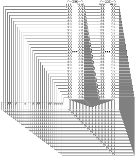

## Mersenne Twister (19937)
Mersenne Twister is by far the most widely used general-purpose PRNG, which derives its name from the fact that its period is the Mersenne prime $2^{19937} -1$  

It is the default PRNG in Dyalog APL, Microsoft Excel, GAUSS, GLib, GNU Multiple Precision Arithmetic Library, GNU Octave, GNU Scientific Library, gretl, IDL, Julia,CMU Common Lisp, Embeddable Common Lisp, Steel Bank Common Lisp, Maple,MATLAB, Free Pascal, PHP, Python,R,Ruby,SageMath, Scilab, Stata, SPSS, SAS, Apache Commons,  standard C++ (since C++11), Mathematica. Add-on implementations are provided in many program libraries, including the Boost C++ Libraries, the CUDA Library, and the NAG Numerical Library.

### Algorithmic Details
The Mersenne Twister algorithm is based on a matrix linear recurrence over a finite binary field $F_2$. The algorithm is a twisted generalised feedback shift register (twisted GFSR, or TGFSR) of rational normal form, with state bit reflection and tampering. 

The internal state is defined by a sequence of $n=624$, 32-bit registers ($w$)  

$$x_{k+n} \to x_{k+m} \oplus (( x_k^{u} \| x_{k+1}^{l})A)$$
To compensate for reduced dimensionality of equidistribution, the state is cascaded with tampering transform (to improve the equidistribution) to produce the outputm

$$y \to x \oplus(( x \gg u)\&d)$$
$$y \to y \oplus(( y \ll s)\&b)$$
$$y \to y \oplus(( y \ll t)\&c)$$
$$z \to y \oplus( y \gg l)$$

The computed $z$ is returned by the algorithm
where the choice of constants is as follows
```python
    w, n, m, r = 32, 624, 397, 31
    a = 0x9908B0DF
    u, d = 11, 0xFFFFFFFF
    s, b = 7, 0x9D2C5680
    t, c = 15, 0xEFC60000
    l = 18
    f = 1812433253 
```

\pagebreak

### Initialization
The state needed for a Mersenne Twister implementation is an array of $n$ values of $w$ bits each. To initialize the array, a w-bit seed value is used to supply $x_0$ through $x_{n-1}$ by setting $x_0$ to the seed value and thereafter setting

$$x_i = f \times (x_{i-1} \oplus (x_{i-1} \gg (w-2))) + i$$

for $i$ from 1 to n-1. The first value the algorithm then generates is based on $x_n$




While implementing, we need to consider only three things   

1. State initialization i.e. seeding
```python
    def seed_mt(seed):
        MT[0] = seed
        index = n
        for i in range(1, n):
            temp = f * (MT[i - 1] ^ (MT[i - 1] >> (w - 2))) + i
            MT[i] = temp & ((1 << w) - 1)
```  
2. The `twist` operation to produce next 624 state registers by "twisting" the current state of 624 registers
```python
    def twist():
        for i in range(n):
            x = (MT[i] & upper_mask) + (MT[(i + 1) % n] & lower_mask)
            xA = x >> 1
            if (x % 2) != 0:
                xA = xA ^ a
            MT[i] = MT[(i + m) % n] ^ xA
        index = 0
```  
3. The `tamper` operation to tamper a state register to the produced 32-bit output
```python
    def extract_number():
        """aka tamper state at index"""
        y = MT[index]
        y = y ^ ((y >> u) & d)
        y = y ^ ((y << s) & b)
        y = y ^ ((y << t) & c)
        y = y ^ (y >> l)
        index += 1
        return y & ((1 << w) - 1)
```

## Background
The primary idea of cracking Mersenne twister comes as a part of [Matasano's Cryptopals challenges](https://cryptopals.com/sets/3/challenges/23), after which
there exist various conference talks for Mersenne twister seed and state recovery for the aid of pentesters at various security conferences e.g  
- [untwister](https://github.com/bishopfox/untwister) presented at B-Sides Las Vegas 2014, which recovers upto 32 bit seeds by a parallalized bruteforce using a pool of workers or state recovery using 624 consecutive outputs (will be discussed soon).  
- [PRNG Cracker](https://dspace.cvut.cz/bitstream/handle/10467/69409/F8-BP-2017-Molnar-Richard-thesis.pdf?sequence=-1&isAllowed=y) which in addition to parallalized seed bruteforcing, creates a rainbow table of outputs for lookup in seed database.  
- [PHP mt_rand predictor](https://www.ambionics.io/blog/php-mt-rand-prediction) achieves seed recover using two outputs which are 227 apart of each other exploiting the improper implementation of Mersenne twister in PHP in particular. This works only for PHP as it doesnt use the standard MT (Mersenne Twister) algorithm.  

### State recovery from 624 consecutive outputs
The Mersenne twister keeps a state of 624 registers `MT` and an index `i` to track the position in the state. Once `i` reaches the end of state array, the `twist` operation is called to twist the state to next 624 numbers in the sequence and `i` is set to 0. The output $y_i$ is generated using the `tamper` function on the state `MT[i]`. This tamper function is completely reversible, hence given $y_i$ we can recover `MT[i]`. Once we recover any 624 state registers, we can set $i=0$ from there and predict any future outputs.

#### Untamper
Each of the step of instructions in `tamper` is reversible since it is simple xor of a register and right or left shifted select bits of it. Merely tracking which bits were xored with which bits of the input register to get the next value, we can undo the operation. Since in xoring with right shifting, the MSB of y would be MSB of x, and in xoring with left shifting, the LSB of y will be LSB of x.
```python
def untamper(num):
    def get_bit(number, position):
        if position < 0 or position > 31:
            return 0
        return (number >> (31 - position)) & 1

    def set_bit_to_one(number, position):
        return number | (1 << (31 - position))

    def undo_right_shift_xor_and(result, shift_len, andd=-1):
        original = 0
        for i in range(32):
            if get_bit(result, i) ^ \
                (get_bit(original, i - shift_len) &
                    get_bit(andd, i)):
                original = set_bit_to_one(original, i)
        return original

    def undo_left_shift_xor_and(result, shift_len, andd):
        original = 0
        for i in range(32):
            if get_bit(result, 31 - i) ^ \
                (get_bit(original, 31 - (i - shift_len)) &
                    get_bit(andd, 31 - i)):
                original = set_bit_to_one(original, 31 - i)
        return original
    num = undo_right_shift_xor_and(num, l)
    num = undo_left_shift_xor_and(num, t, c)
    num = undo_left_shift_xor_and(num, s, b)
    num = undo_right_shift_xor_and(num, u, d)
    return num
```

## Our work
We began with the implementation of standard MT19937 from algorithm described in [Mersenne Twister on Wikipedia](https://en.wikipedia.org/wiki/Mersenne_Twister). This involved a lot of debugging and testing against various random number library implementations, reading the source code of the MT implementations in  
- [Python _randommodule.c](https://github.com/python/cpython/blob/master/Modules/_randommodule.c)  
- [ruby_2_7/random.c](https://github.com/ruby/ruby/blob/ruby_2_7/random.c)  
- [PHP random.c](https://github.com/php/php-src/blob/master/ext/standard/random.c)  
- [C++ libstdc++ gcc](https://code.woboq.org/gcc/libstdc++-v3/include/bits/random.tcc.html)   

And figuring out how each of these vary from the standard implementation on wiki. 
More or less, each one of these use the standard MT as an API to extract 32 bit uniformly random values from the underlying state of MT then constructing their own API out of this functionality.  
These include improved (and hence more non linear) initialization called `init_by_array` as proposed in [MT2002](http://www.math.sci.hiroshima-u.ac.jp/m-mat/MT/MT2002/emt19937ar.html), translation of equivalent functions from (usually) underlying c implementations to python and testing them rigorously to match the outputs and state. This is a bit challenging due to the fact python treats all integers without bounds and we need to ensure the general assertion of `int_32` everywhere is valid.

### Modelling
After getting all the underlying algorithms and functionalities right, we modelled the seed recovery algorithm as a [Satisfiability Modulo Theories](https://en.wikipedia.org/wiki/Satisfiability_modulo_theories) (SMT) decision problem, which is an extension of SAT with theories in first order logic.   
We used the SMT solver [Z3Prover](https://github.com/Z3Prover/z3), as a sequential program written in theory of BitVectors(32) (since the algorithm is designed to work on 32bit architectures) and theory of BitVectors(64) for MT19937-64 . After (painfully) modelling the program, we begin a SAT solver search (all-SAT to give all satisfying models for possible seed values) which leads us to a given sequence of outputs (the generated random numbers).  
The core idea behind using z3 is that it mixes the program data and the program quite well, eases the modelling a lot. All we need to care about the correct SMTlib implementations to use as the general notion of various operators like bitshifts, comparisons are translated differently based on different scenarios by a compiler.  
e.g. the `tamper` state when written for a `BitVec(32) y` is almost exactly same as we would have written for a python-int
```python
def tamper_state(y):
    y = y ^ (LShR(y, u) & d)
    y = y ^ ((y << s) & b)
    y = y ^ ((y << t) & c)
    y = y ^ (LShR(y, l))
    return y
```
Note that `tamper_state(y)` actually returns the bitvector computation
```python
     y ^ LShR(y, 11) & 4294967295 ^ 
    (y ^ LShR(y, 11) & 4294967295) << 7 & 2636928640 ^
    (y ^ LShR(y, 11) & 4294967295 ^
    (y ^ LShR(y, 11) & 4294967295) << 7 & 2636928640) << 15 & 
    4022730752 ^ LShR(
     y ^ LShR(y, 11) & 4294967295 ^
    (y ^ LShR(y, 11) & 4294967295) << 7 & 2636928640 ^
    (y ^ LShR(y, 11) & 4294967295 ^
    (y ^ LShR(y, 11) & 4294967295) << 7 & 2636928640) << 15 &
    4022730752, 18)
```

And the general line of thinking while encoding a problem in SMT would be to find a `y` such that `tamper_state(y)==x` for a given value of interest `x`. Thus after solving for `y` we get the value which led the given value `x`.  
```python
def untamper_sat(num):
    S = Solver()
    y = BitVec('y', 32)
    y = tamper_state(y)
    S.add(num == y)
    if S.check() == sat:
        m = S.model()
        return m[m.decls()[0]].as_long()
```
This serves as an alternative to the `untamper` proposed earlier, although it is around ~100 times slower due to the overheads involving calling the z3 c++ API internally. But what advantages it provides with respect to the original untamper is that we can find all possible candidates `y` given say truncated output `untamper_state(y) >> truncation`.  
Although SAT/SMT solvers are designed to find a single satisfying assignment, they can be extended easily (with a bit of overhead) to find all possible satisfying assignments by blocking and fixing terms over the search space thus enabling the solver to use previously learned clauses effectively [Programming Z3](https://theory.stanford.edu/%7Enikolaj/programmingz3.html#sec-blocking-evaluations)  
```python
def all_smt(s, initial_terms):
    def block_term(s, m, t):
        s.add(t != m.eval(t))
    def fix_term(s, m, t):
        s.add(t == m.eval(t))
    def all_smt_rec(terms):
        if sat == s.check():
           m = s.model()
           yield m
           for i in range(len(terms)):
               s.push()
               block_term(s, m, terms[i])
               for j in range(i):
                   fix_term(s, m, terms[j])
               for m in all_smt_rec(terms[i:]):
                   yield m
               s.pop()   
    for m in all_smt_rec(list(initial_terms)):
        yield m       
```

Similarly, another crucial function i.e. `twist` can be easily modelled as  
```python
def twist_state(self, MT):
    for i in range(n):
        x = (MT[i] & upper_mask) + \
            (MT[(i + 1) % n] & lower_mask)
        xA = LShR(x, 1)
        xA = If(x & 1 == 1, xA ^ a, xA)
        MT[i] = simplify(MT[(i + m) % n] ^ xA)
```
Note the use of `simplify` to simplify the required expression, which may seem unnecessary but given the fact that `MT[i]` derives from `MT[i+1]` and `MT[i+m]`, this expression grows exponentially and consume a lot of memory, thus simplifying the expressions at each step cut down the memory and also due to reduced sizes of internal ASTs, run considerably faster.  

#### MT seed recovery
Getting set up all the required functions and implementations, we can model the standard
MT output generation and seeding.  
Since the seeding process initializes the first state as the seed itself and state i is just a function of state (i-1), each initial state is expected to have enough bits of information about the seed.  
The output is generated after twisting the initialization. So intuitively, 2-3 states should be sufficient to recover the seed. 
```python
def get_seed_mt(outputs):
    STATE = [BitVec(f'MT[{i}]', 32) for i in range(n)]
    SEED = BitVec('seed', 32)
    STATE[0] = SEED
    for i in range(1, n):
        temp = f * \
            (STATE[i - 1] ^ (LShR(STATE[i - 1], (w - 2)))) + i
        STATE[i] = temp & ((1 << w) - 1)
    twist_state(STATE)
    S = Solver()
    for index, value in outputs:
        S.add(STATE[index] == untamper(value))
    if S.check() == sat:
        m = S.model()
        return m[m.decls()[0]].as_long()
```
Testing out experimentally, we found out that **3** consecutive outputs are sufficient to determine the seed uniquely and takes **~200 seconds**.

#### Finding past outputs
Recoverying the state and subsequently finding the future outputs is obvious, but to find past inputs is not so trivial since every 624-th output the state is twisted, which is function of $(i-624)^{th}$, $(i-623)^{th}$ and $(i-227)^{th}$ outputs and we dont have sufficient information to recover those just using a single output. But this can be done again by modelling the previous state, twisting it and comparing the output.
```python
def untwist(outputs):
    MT = [BitVec(f'MT[{i}]', 32) for i in range(n)]
    twist_state(MT)
    s = Solver()
    for i in range(len(outputs)):
        s.add(outputs[i] == MT[i])
    if s.check() == sat:
        model = s.model()
        ut = {str(i): model[i].as_long() for i in model.decls()}
        return [ut[f'MT[{i}]'] for i in range(n)]
```
Thus, the state can be twisted easily and almost instantaneously, upto the correctness of 623 states and MSB of first value, since only the MSB of first value is used in the twist operation.

#### State recovery with truncated outputs
State recovery from the standard 32-bits outputs is very restrictive. We explored more general ways of state recovery from truncated outputs i.e when the required output is not 32 bits.  
When less than 32 bits are required, the given 32-bit random value of MT is masked or truncated to produce a given output. If a value larger than 32 bits is required, as many 32-bit calls are made and the last one is truncated.  
We discuss a general and quite frequently used scenario `random.random()` i.e. floating point random number generation between [0,1]. Looking at how it is implemented, we find  
```python
def random.random():
    a = extract_number()>>5
    b = extract_number()>>6
    # 2**53 = 9007199254740992.0
    # 2**26 = 67108864
    return (a*67108864.0+b)*(1.0/9007199254740992.0)
```
to generate a uniform random 64-bit floating point between [0,1], it will require 53-bit precision for which it makes two underlying MT calls, first call is truncated 5 bits to give MSB 27 bits and second truncated 6 bits to give LSB 26 bits. This can be modelled effectively by assuming a starting state of MT array, extracting outputs and twisting whenever it is required.  
```python
def state_recovery_rand(outputs):
    MT = [BitVec(f'MT[{i}]',32) for i in range(624)]
    values = []
    for i in outputs:
        values.extend( divmod(int(i*2**53),2**26))
    S = Solver()
    for i in range(len(values)):
        if i%624==0:
            twist_state(MT)
        S.add(LShR(tamper_state(MT[i%624]),5+(i&1))==values[i])
    if S.check()==sat:
        model = S.model()
        mt = {str(i): model[i].as_long() for i in model.decls()}
        mt = [mt[f'MT[{i}]'] for i in range(len(model))]
        return mt
```
Thus we can also recover state correctly and uniquely using 624 outputs again in approximately **60 seconds**.

#### Python init_by_array seed recovery
In all the modern instances of MT, `init_by_array` is used which initializes the MT state using an array of 32-bit seeds, thus eliminating the possible $2^{32}$ seed space and improving initialization and producing better distributed outputs.  
```python
def init_by_array(init_key):
    seed_mt(19650218)
    i, j = 1, 0
    for k in range(max(n, len(init_key))):
        MT[i] = (MT[i] ^ (
            (MT[i - 1] ^ (MT[i - 1] >> 30)) * 1664525)) + init_key[j] + j
        MT[i] &= 0xffffffff
        i += 1
        j = (j+1)%len(init_key)
        if i >= n:
            MT[0] = MT[n - 1]
            i = 1
    for k in range(n - 1):
        MT[i] = (MT[i] ^ (
            (MT[i - 1] ^ (MT[i - 1] >> 30)) * 1566083941)) - i
        MT[i] &= 0xffffffff
        i += 1
        if i >= n:
            MT[0] = MT[n - 1]
            i = 1
    MT[0] = 0x80000000
```
Given a set of outputs, recovering the initial seed is a lot tricky here.  
First of all, length of `init_key` is required. Secondly, there are two loops involved, each setting `MT[i]` as previous `MT[i]` and `MT[i-1]` thus blowing the size of constraints.  
To overcome this problem, we split the problem into smaller chunks, i.e recovering the state before the second loop, then recoverying the state before first loop.  
The requirement of knowing the size of `init_key` is skipped by assuming it to be of size 624 and then deducing patterns between the possible `init_key` array and finding the length of the key.  
One may assume that we would observe repeating values in 624 sized key, but it is counter-intuitive given the fact that solver uses its freedom to have
`init_key[j] + j` instead of `init_key`. Thus earlier modelling of assumption of keysize performed poorly and scaled badly when we increased the size of `init_key` and we had to enumerate our assumption of key size till we find the valid key.  

On updating the solution based on the given observations by splitting into smaller independent sequential problems, and observing patterns to deduce the key size, we were able to cut running times from about 30 minutes + 15minutes * len(init_key) on known len(init_key)  to **~5 minutes** without knowing length of key.

### Results
We were able to recover the seed of the Mersenne twister for both MT19937 and MT19937-64 using any **3** consecutive outputs, in about **~200 seconds**.  

The modelling of `untwist` can reverse the `twist` operation to go back 624 outputs, which cannot be done easily by any of usual methods thus enabling us to predict unseen outputs which were produced before the observed set of outputs.  

Our method is extremely memory and space efficient since SAT solvers work with negligible memory **(<500 MB)**. And they are way faster and efficient considering the space time tradeoff involved.

Given insufficient information about the state bits, we can still effectively enumerate all possible solutions given the amount of information at hand without compromising the quality of solutions.

The same methodology is applicable and extendible to various other cases where it might not be possible at all to come up with an angle of attack. For example.
- Outputs of non-32 bit sizes, say `random.gerandbits(31)` is called
- One of the most used methods from random library is usually `rand` which generates a random float in 0 to 1 (which internally makes two MT calls and throws away 11 bits to generate the random number). We can recover state using **624** outputs in **~60 seconds**
- `random.randrange(1,n)` is called which may internally make use of multiple MT calls.

All of the various methods from random libraries can be used to recover the state/seed whereas all other approaches merely work if only we have 624 consecutive `random.getrandbits(32)` calls which is quite rare to observe in a real life application.

## Challenges
While the wikipedia implementation is treated as the standard Mersenne twister, we found that our implementation was producing different outputs from the implementations in programming languages even after initializing by the same seed. After dissecting a lot of source code, we figured out that the wiki implementation serves as the base of Mersenne twister implementation everywhere with a difference in the way it is seeded. All modern Mersenne twister are seeded with a function `init_by_array` which takes an array of 32-bit seeds (or 32 bit hashes of seed objects). Later we found that this was proposed as an enhancement to equidistribution property to the base Mersenne twister [MT2002](http://www.math.sci.hiroshima-u.ac.jp/m-mat/MT/MT2002/emt19937ar.html).  
This `init_by_array` is much more non-linear that the standard `seed_mt` operation and makes it much more difficult to recover the seed values from a few outputs. We tried following the same approach, and it turns out it was unable to deduce the seed even in a couple of hours. 

Yet another major challenge was to understand the exact API and studying what exactly to use.  
e.g `BitVec` class of z3 assumes the bitvector to be signed. Consequently, we will need to define the `>>` the shift right operator as either logical shift right (`z3.LShR`) or arithmetic shift right (which is `>>` the `__rshift__` magic method in `BitVec` class). Mistakably using `>>` to shift right logically, costed us a lot of debugging time and a lot of `unsat` examples, which were quite hard to figure out due to the unsuspecting sign of things.

## Limitations
The most basic limitation of seed/state recovery using SMT/SAT solvers is figuring out the time complexity and approximate time required to find a satisfying assignment of our choice. While researching, it is almost like running through a jungle as we never know how much time it would take us to find a way.  
The time required to find a satisfying assignment is also very dependent on the way the problem was encoded. Seemingly similar modelling/encoding can end up in drastically different run times as the solver may end up using completely different heuristics and paths to find a goal. So the major drawback is finding out the best way or a good enough way to recover the seeds of a given PRNG algorithm.  

Other drawback of our approach is that SMT solvers operate in the realm of first order logic. If a given algorithm can not be encoded in FOL, SMT solver wont be able to find a satisfying assignment (though all the work we did can be translated easily under FOL).

Another drawback can be when there are more than one possible seed/state to produce a given set of outputs, SAT solvers are designed and optimized to find a single satisfying assignment, finding successive assignments, may or may not translate equivalently.

Yet another drawback is lack of parallelism. The current design of SAT/SMT solvers is massively single threaded and may not use the full capabilities and cores of the machine to find a satisfying assignment.


## References
- [The Mersenne Twister](http://www.quadibloc.com/crypto/co4814.htm) http://www.quadibloc.com/crypto/co4814.htm
- [Mersenne twister wikipedia](https://en.wikipedia.org/wiki/Mersenne_Twister) https://en.wikipedia.org/wiki/Mersenne_Twister
- [Satisfiability Modulo Theories](https://en.wikipedia.org/wiki/Satisfiability_modulo_theories) https://en.wikipedia.org/wiki/Satisfiability_modulo_theories
- [Matasano's Cryptopals challenges](https://cryptopals.com/sets/3/challenges/23) https://cryptopals.com/sets/3/challenges/23
- [untwister](https://github.com/bishopfox/untwister) https://github.com/bishopfox/untwister
- [PRNG Cracker](https://dspace.cvut.cz/bitstream/handle/10467/69409/F8-BP-2017-Molnar-Richard-thesis.pdf?sequence=-1&isAllowed=y) https://dspace.cvut.cz/bitstream/handle/10467/69409/F8-BP-2017-Molnar-Richard-thesis.pdf?sequence=-1&isAllowed=y
- [PHP mt_rand predictor](https://www.ambionics.io/blog/php-mt-rand-prediction) https://www.ambionics.io/blog/php-mt-rand-prediction
- [Python _randommodule.c](https://github.com/python/cpython/blob/master/Modules/_randommodule.c) https://github.com/python/cpython/blob/master/Modules/_randommodule.c
- [ruby_2_7/random.c](https://github.com/ruby/ruby/blob/ruby_2_7/random.c) https://github.com/ruby/ruby/blob/ruby_2_7/random.c
- [PHP random.c](https://github.com/php/php-src/blob/master/ext/standard/random.c) https://github.com/php/php-src/blob/master/ext/standard/random.c
- [C++ libstdc++ gcc](https://code.woboq.org/gcc/libstdc++-v3/include/bits/random.tcc.html) https://code.woboq.org/gcc/libstdc++-v3/include/bits/random.tcc.html
- [MT2002](http://www.math.sci.hiroshima-u.ac.jp/m-mat/MT/MT2002/emt19937ar.html)
- [Z3Prover](https://github.com/Z3Prover/z3) https://github.com/Z3Prover/z3
- [Programming Z3](https://theory.stanford.edu/%7Enikolaj/programmingz3.html#sec-blocking-evaluations) https://theory.stanford.edu/%7Enikolaj/programmingz3.html#sec-blocking-evaluations